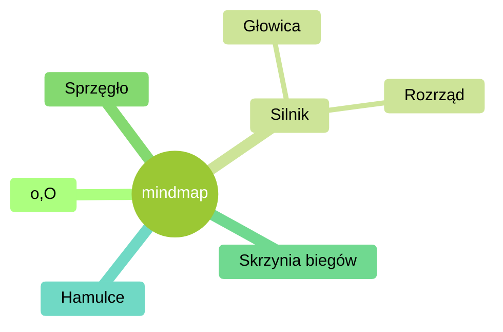

```mermaid
---
config:
  theme: 'forest'
---
mindmap
  root((mindmap))
    o,O
    Silnik
        Głowica
        Rozrząd
    Sprzęgło
    Skrzynia biegów
    Hamulce

```
---

### Hamulce
A więc co mogę powiedzieć  
potrzeba zdjęć  
najlepiej samemu rysować  
z książki skróty do notatki  
więc najpierw książki  
