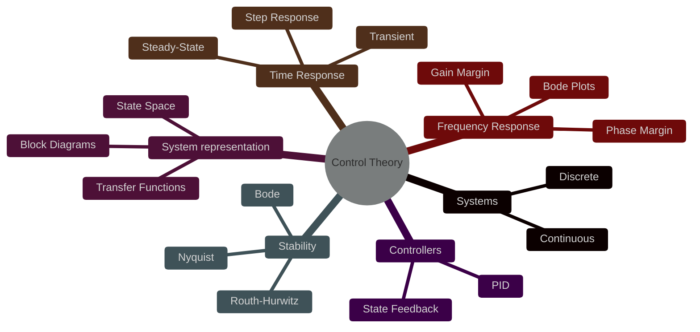

---

### Basics
This note is a quick Control Theory refresher in English.
Start from system modeling and feedback structure, then move into stability and response analysis.
We can explore each topic one by one:
- system representation
- feedback and control design
- stability criteria
- time and frequency domain behavior
- controller types

### System representation 
- What is the difference between a transfer function and a state-space model?
- When would you prefer one over the other
- How do block diagrams help when you combine several subsystems?
  